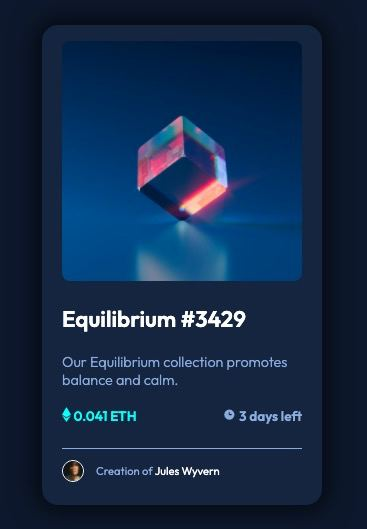

# Frontend Mentor - NFT preview card component solution

This is a solution to the [NFT preview card component challenge on Frontend Mentor](https://www.frontendmentor.io/challenges/nft-preview-card-component-SbdUL_w0U). Frontend Mentor challenges help you improve your coding skills by building realistic projects. 

## Table of contents

- [Overview](#overview)
  - [The challenge](#the-challenge)
  - [Screenshot](#screenshot)
  - [Links](#links)
- [My process](#my-process)
  - [Built with](#built-with)
  - [What I learned](#what-i-learned)
- [Author](#author)

## Overview

### The challenge

Users should be able to:

- View the optimal layout depending on their device's screen size
- See hover states for interactive elements

### Screenshot



### Links

- Solution URL: [Add solution URL here](https://your-solution-url.com)
- Live Site URL: [Add live site URL here](https://your-live-site-url.com)

## My process

### Built with

- Semantic HTML5 markup
- CSS custom properties
- Flexbox

### What I learned

Use this section to recap over some of your major learnings while working through this project. Writing these out and providing code samples of areas you want to highlight is a great way to reinforce your own knowledge.

To see how you can add code snippets, see below:

This was the code that used in order to do the hover effect on the image. I've never done this, and I'm pretty sure that there are better ways to do it, but this worked for me for this projet.

```css
.hover-color {
        position: relative;
        top: -101.1%;
        background-color: hsl(178, 100%, 50%);
        height: 100%;
        display: flex;
        justify-content: center;
        align-items: center;
        opacity: 0;
        border-radius: 10px;
    }

    .hover-color img:hover {
        height: 50px;
        color: white;
        opacity: 1;
    }

    .hover-color:hover {
        opacity: 0.5;
    }
```

## Author

- Frontend Mentor - [@yourusername](https://www.frontendmentor.io/profile/KevDCS)
- Twitter - [@yourusername](https://www.twitter.com/codosho)
